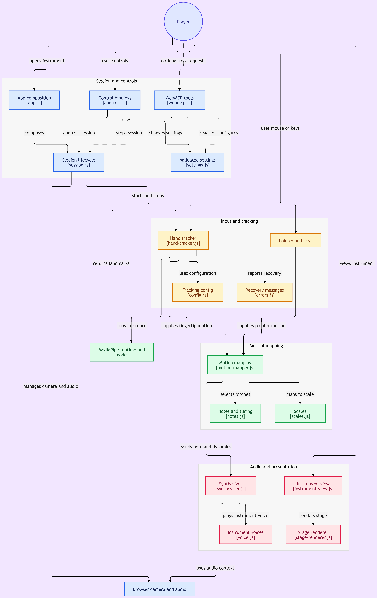
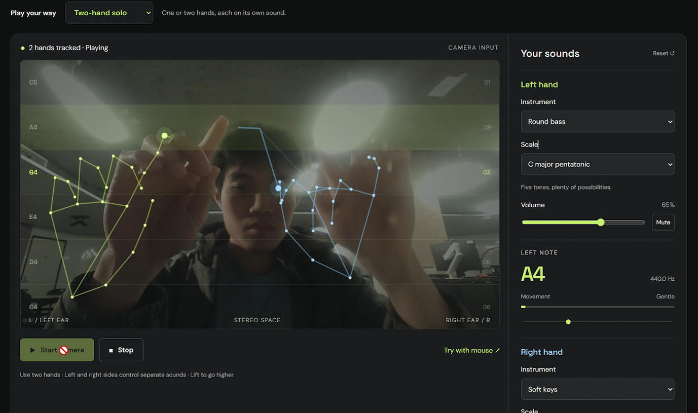

# Muvesic

A browser instrument you play with your body. Your webcam watches your hands and pose, and every movement becomes a note.

**[Live Demo](https://muvesic.netlify.app/)**


Three ways to play:

- **Two-hand solo.** A tracked index fingertip controls a browser synthesizer: height selects pitch, horizontal position controls stereo pan, and speed changes note velocity.
- **Orchestra.** One hand conducts a four-section ensemble (strings, woodwinds, brass and cello) on a single diatonic chord.
- **Move your body.** Each limb becomes its own voice on one shared instrument, four octaves apart, so the band reads as one player.

Everything is processed on the player's device. There is no backend, no account, no microphone access, no recording and no video upload.

## Run

Install Node.js 20 or newer, then run:

```sh
npm run dev
```

Open **http://localhost:5173** in a recent desktop Chrome or Edge browser. No npm dependencies or build step are needed. The authored, deployable application lives in `dist/`.

1. Pick a performance in **Play your way**: **Two-hand solo**, **Orchestra** or **Move your body**.
2. Click **Start camera** and allow camera access.
3. In solo, show one or two hands, keeping each index fingertip visible. The left side of the screen controls the left instrument, and the right side controls the right instrument.
4. Lift to play higher notes; move sideways to pan; move faster for louder attacks.
5. Choose Soft keys, Warm synth, Glass bell, Round bass, or Plucked guitar for each hand, and a pentatonic, major, or minor scale.
6. **Close your fist to silence** the active hand or ensemble without leaving the session - open the hand again to keep playing.
7. Stop releases the webcam, tracking model and audio context. Reset also restores defaults. Changing tabs automatically stops the session.

**Try with mouse** provides a camera-free way to play using the same mapping and audio engine. Click Start playing, then move over the stage, drag on a touchscreen, or focus the stage and use arrow keys. Escape stops either mode. Touchscreen layout is supported, but webcam performance is targeted at desktop laptops.

## Design and implementation

The application is split by responsibility so contributors can work in separate files:

- `dist/app/`: session lifecycle, validated settings and control bindings.
- `dist/ui/`: DOM presentation and canvas rendering.
- `dist/input/`: pointer, touch and keyboard input.
- `dist/music/`: scales, tuning, motion-to-note mapping, section arrangements and the body mapper.
- `dist/audio/`: synthesis, individual voices and cleanup.
- `dist/tracking/`: camera/model lifecycle, configuration, recovery messages, body pose geometry and posture rules.
- `dist/integrations/`: optional WebMCP tools.
- `dist/shared/`: math and resource deadline helpers.
- `dist/app.js`: small composition entry point; root music/audio/tracker modules preserve public imports.
- `scripts/`: dependency-free development server and recursive syntax checks.

See [Architecture](docs/architecture.md) for ownership, data flow, lifecycle contracts and extension recipes. See [Contributing](CONTRIBUTING.md) for parallel development, merge guidance and review checks.

## Architecture



The diagram above maps each directory to the responsibility it owns. The full architecture document covers data flow, lifecycle contracts, performance modes, the body-mode pipeline, the hand-close mute, and extension recipes for adding a new scale, sound, input, camera provider, posture or limb.

The default pentatonic spans C4 to C5 (five distinct pitch classes plus the top octave). Camera mode tracks up to two hands. Hands are assigned by mirrored screen position: the left side controls the left instrument and the right side controls the right instrument. Missing or stale frames release only that side's current voice and reset its movement history. Note that MediaPipe inference runs synchronously on the main thread, capped near 30 Hz; actual frame rate and latency depend on the device and have not been benchmarked on physical webcam hardware.

## Network and deployment

Camera access requires **HTTPS or localhost**. Do not open `index.html` with a `file://` URL. Host the entire `dist/` directory, including its module subdirectories, on a static HTTPS host.

Camera mode downloads the pinned `@mediapipe/tasks-vision@0.10.22-rc.20250304` JavaScript/WASM from jsDelivr and Google's version-1 float16 Hand Landmarker model. Body mode loads Google's version-1 float16 Pose Landmarker lite model from the same runtime. The model/runtime are fetched on start; video frames stay in the browser. Internet access to those hosts is required, and first startup can take several seconds. Mouse mode does not load MediaPipe. Google Fonts is optional; system fonts are used if it is unavailable. For an offline or restricted-network installation, vendor the runtime, WASM, models and fonts, then update their URLs.

MediaPipe integration follows the [official Hand Landmarker web guide](https://ai.google.dev/edge/mediapipe/solutions/vision/hand_landmarker/web_js) and the [Pose Landmarker guide](https://ai.google.dev/edge/mediapipe/solutions/vision/pose_landmarker/web_js). Camera permission failures, unavailable cameras, model-loading failures and disconnects show recovery instructions. Permission/model startup can be cancelled with Stop, including while the browser permission prompt is pending.

## Verification

```sh
npm run check
npm test
```

Tests cover musical mapping, jitter suppression, note gating, tracking reacquisition, dynamics, tuning, audio graph lifecycle with an AudioContext test double, cancellation/deadline disposal, error messages, session cancellation/restart races, settings validation, control binding against the real element ids, panel exclusivity against the real markup, and HTTP serving of every nested module. Body mode adds pose acceptance, framing, distance-invariant posture geometry, classifier hysteresis, auto-calibration, the four-limb dispatch and the session's tracker switching, against a pose fixture that can be moved around and resized. They do not substitute for hearing the audio or exercising a physical webcam.

Manual acceptance: start the camera; check that each skeleton aligns with the mirrored hand; play separate low-to-high melodies on the left and right sides; compare slow and fast movement; move one hand out of frame and verify only that side goes silent; close your fist and verify only that hand or the ensemble goes silent; stop and confirm the camera indicator turns off. Also try permission denial, model/network failure, mute, reset, tab switching and restarting during startup. In orchestra mode, confirm the second hand panel is gone, the four section readouts update, and moving the conductor out of frame silences the ensemble and lets it resume on return. In body mode, see the checklist below.

Optional `document.modelContext` tools configure/read settings and stop sessions, sharing the UI actions. They are feature-detected and never start camera/audio. A supported WebMCP browser context is needed to validate their registration; automated verification here does not cover that browser proposal.

## Two-hand multi-instrument / finger tracking mode



The default mode is two independent hands, each driving its own instrument. A MediaPipe Hand Landmarker tracks up to two hands per frame and assigns each one to the left or right side of the screen (after mirroring, so a hand on the player's right drives the right-side instrument). Each index fingertip runs through the same `MotionMapper`: vertical position selects pitch within the chosen scale, horizontal position pans the voice across the stereo field, and how fast the fingertip moves scales the velocity (and the meter on the side panel).

Each hand has its own settings row on the right:

- **Instrument:** Soft keys, Warm synth, Glass bell, Round bass or Plucked guitar.
- **Scale:** pentatonic (the default — five tones, easy to play in), C major or A minor.
- **Volume and mute:** per-hand, independent.

The two-handed skeleton is drawn over the camera feed so you can see which hand is mapped to which side. Hands are assigned by mirrored screen position, not identity, so swapping which hand you use does not switch the assigned channel — left side stays left. The run section above walks through getting started; the architecture doc describes the finger-to-note pipeline in detail.

Closing a fist mutes just that hand's voice (the other hand keeps playing), so you can silence one part without ending the session. Open the hand again and it picks up.

## Orchestra mode

Choose **Orchestra** in the **Play your way** selector above the stage, then start the camera or switch to mouse input. Each pitch leads a diatonic harmony across synthesized strings, woodwinds, brass and cello. Lift your finger or pointer for higher harmonies, move sideways to pan the ensemble, and move faster into a new pitch for a louder attack. Arrow keys and touch input also work.

One hand conducts the whole ensemble, so the two-hand panels are replaced by a single **Ensemble** panel: the four sections show the note each one is playing, and the scale, volume and mute controls below shape all of them together. Per-hand instrument selects are put away, because the arrangement picks the section timbres. One scale is shown rather than two, since both hands would play the same one.

Orchestra uses C major harmony for the major and pentatonic scales, and A minor harmony for the minor scale. These are browser-synthesized timbres, not recorded orchestral samples. Choose **Two-hand solo** to return to your selected solo sound. The two modes are exclusive: switching releases the previous notes, and Stop, tracking loss and Reset release every section. If the conductor leaves the frame the ensemble goes quiet and picks up again when the hand returns, without stopping the session. Closing the conductor's fist mutes the ensemble instantly without leaving the session.

## Body mode

Choose **Move your body** in the **Play your way** selector, then start the camera. Stand back far enough that your whole body is in frame, and hold still for a moment while Muvesic learns your neutral pose. It says so on the stage, and nothing plays until it has.

Your body becomes four independent voices, one per limb:

| Limb | What it reads | Default octave |
| --- | --- | --- |
| Left arm | Wrist height above your hip | mid (C4) |
| Right arm | Wrist height above your hip | one octave up (C5) |
| Left leg | Ankle height above your hip | two octaves down (C2) |
| Right leg | Ankle height above your hip | one octave down (C3) |

All four limbs use the same instrument by default — Glass bell — so they read as one band with four voices rather than four separate things. Each limb has its own volume, mute and scale on the side panel. Raise an arm to play higher, raise a leg to play higher still, squat to dip the legs down an octave. Legs that leave the frame go silent on their own; arms keep playing.

Postures shape the four voices together rather than adding notes, so the same note never turns into a different one mid-phrase:

| Posture | What it does |
| --- | --- |
| Arms up | Lifts the arms an octave, leaves the legs |
| Squat | Drops the legs an octave, leaves the arms |
| Wide | Opens the stereo image across all four |
| Lean | Drags the whole rig sideways by your torso tilt |
| Twist | Marks a turn in the groove |
| Jump | The biggest accent, when your feet leave the floor |
| Holding still | A quiet sustained shape rather than silence |

A posture has to hold for a moment before it counts, and does not flicker once it does, so you can shape a phrase instead of fighting a stutter.

Everything is measured against your own body. Arm height, crouch, reach and ankle height are all read as fractions of your torso, so stepping back to get your feet in frame does not change the tuning, and neither does moving closer to a low desk. If your feet are out of frame the stage asks you to step back, otherwise it keeps playing with your upper body.

The stage draws four equal pulsing dots, one per limb. The ring around each dot breathes with that limb's intensity, so a still limb reads as a steady dot and a moving limb reads as a breathing one.

Body mode needs a different model on the camera than the hand modes do, so switching into or out of it stops the session and asks you to start again. **Try with mouse** has no posture to read, so it returns you to two-hand solo. These are browser-synthesized timbres rather than recorded samples.

### Manual acceptance for body mode

1. Stand back and check the skeleton lines up with your mirrored body.
2. Hold still and confirm the stage asks you to, then starts playing on its own.
3. Raise one arm and confirm it plays higher than the other three limbs; raise a leg and confirm the same leg reads higher than its resting lane.
4. Hold a posture and confirm it settles rather than flickering, and that the four limb panels and the pulsing dots change with it.
5. Step back until your feet leave the frame, confirm the stage asks for more room, then step forward and keep playing.
6. Walk out of frame entirely and confirm it goes quiet and resumes without stopping the session.
7. Step away from the camera and confirm the notes do not change.
8. Stop, then switch to two-hand solo and start again.
